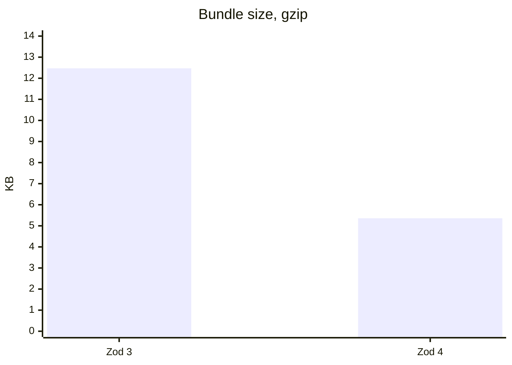

<div class="absolute inset-0 bg-cover bg-center" style="background-image: url('/images/zod-cover-unsplash.jpg')"></div>
<div class="absolute inset-0 bg-[#050914]/82"></div>
<div class="absolute inset-0 opacity-35" style="background-image: linear-gradient(rgba(65, 141, 255, 0.18) 1px, transparent 1px), linear-gradient(90deg, rgba(65, 141, 255, 0.18) 1px, transparent 1px); background-size: 42px 42px;"></div>
<div class="absolute bottom-12 right-12 w-[520px] rounded border border-[#418DFF]/35 bg-black/45 p-5 font-mono text-xs leading-5 text-[#9cc5ff] shadow-2xl shadow-[#418DFF]/10">
  <div class="mb-3 flex gap-2">
    <span class="h-2.5 w-2.5 rounded-full bg-[#418DFF]"></span>
    <span class="h-2.5 w-2.5 rounded-full bg-slate-500"></span>
    <span class="h-2.5 w-2.5 rounded-full bg-slate-600"></span>
  </div>
  <div class="space-y-1 opacity-85">
    <div><span class="text-slate-500">import</span> * <span class="text-slate-500">as</span> z <span class="text-slate-500">from</span> <span class="text-white">"zod"</span>;</div>
    <div>&nbsp;</div>
    <div><span class="text-slate-500">const</span> User = z.object({</div>
    <div class="pl-4">name: z.string(),</div>
    <div class="pl-4">age: z.number().int(),</div>
    <div>});</div>
    <div>&nbsp;</div>
    <div>User.parse({ name: <span class="text-white">"Alice"</span>, age: 30 });</div>
  </div>
</div>

<div class="relative z-10 flex h-full flex-col justify-center pr-[420px] text-white">
  <div class="mb-5 w-max rounded-full border border-[#418DFF]/50 bg-[#418DFF]/10 px-4 py-1 text-sm font-semibold text-[#9cc5ff]">
    Zod 4 для разработчиков
  </div>

  <h1 class="mb-5 text-6xl font-bold leading-tight">
    Что нового<br />
    в <span class="text-[#418DFF]">Zod 4</span>
  </h1>

  <p class="max-w-2xl text-xl leading-8 text-slate-200">
    Что изменилось, зачем это важно и как выглядит код после обновления.
  </p>

  <div class="mt-12 grid max-w-3xl grid-cols-3 gap-4 text-center">
    <div class="rounded border border-[#418DFF]/35 bg-white/5 p-4 backdrop-blur">
      <div class="text-3xl font-bold text-[#418DFF]">14.7x</div>
      <div class="text-sm text-slate-300">быстрее строки</div>
    </div>
    <div class="rounded border border-[#418DFF]/35 bg-white/5 p-4 backdrop-blur">
      <div class="text-3xl font-bold text-[#418DFF]">-57%</div>
      <div class="text-sm text-slate-300">gzip bundle</div>
    </div>
    <div class="rounded border border-[#418DFF]/35 bg-white/5 p-4 backdrop-blur">
      <div class="text-3xl font-bold text-[#418DFF]">v3 + v4</div>
      <div class="text-sm text-slate-300">параллельные импорты</div>
    </div>
  </div>

  <div class="absolute bottom-5 left-8 text-xs text-slate-400">
    Фото: Bernd Dittrich / Unsplash
  </div>
</div>

---
layout: two-cols-header
---

# Главная идея Zod 4

Zod 4 не пытается поменять привычную модель работы. Он сохраняет знакомый API, но
переписывает внутренности: быстрее парсит, меньше нагружает TypeScript и лучше
подходит для production bundle.

::left::

## Что улучшается

<v-clicks>

- производительность runtime-парсинга
- скорость и устойчивость `tsc`
- размер клиентского бандла
- JSON Schema без сторонних пакетов
- метаданные для документации и OpenAPI

</v-clicks>

::right::

## Что остается знакомым

```ts {all|1|3-6|8}
import * as z from "zod";

const User = z.object({
  name: z.string(),
  age: z.number(),
});

User.parse({ name: "Alice", age: 30 });
```

---

# 1. Парсинг стал быстрее

Переписанный движок парсинга дает кратный прирост без изменения API.

| Тип данных | Ускорение |
| ---------- | --------- |
| Строки     | 14.7x     |
| Массивы    | 7.4x      |
| Объекты    | 6.5x      |

```ts {all|3-6|8}
// Zod 3 и Zod 4: код выглядит одинаково.
// Разница находится внутри библиотеки.
const schema = z.object({
  name: z.string(),
  age: z.number(),
});

schema.parse({ name: "Alice", age: 30 });
```

<!--
Акцент: для большинства пользователей это бесплатное ускорение после обновления.
-->

---
layout: two-cols-header
---

# 2. TypeScript-компилятору стало легче

В Zod 3 цепочки `.extend()` и `.omit()` могли резко увеличивать число инстанциаций
типов. В Zod 4 эта нагрузка существенно снижена.

::left::

## Было: Zod 3

```ts {all|4-7|8}
import * as z from "zod";

const a = z.object({ a: z.string(), b: z.string() });
const b = a.omit({ a: true });
const c = b.extend({ a: z.string() });
const d = c.omit({ a: true });

// Дальше: медленная компиляция
// или ошибка "Possibly infinite"
```

::right::

## Стало: Zod 4

```ts {all|4-8|10}
import * as z from "zod";

const a = z.object({ a: z.string(), b: z.string() });
const b = a.omit({ a: true });
const c = b.extend({ a: z.string() });
const d = c.omit({ a: true });
const e = d.extend({ a: z.string() });

// Те же цепочки, но tsc работает быстрее
```

---

# 3. Меньше размер бандла

Для минимального скрипта с `z.boolean()` gzip-размер заметно сократился.



Главный вывод: меньше JavaScript в браузере без переписывания пользовательского кода.

---
layout: two-cols-header
---

# 4. Zod Mini

`zod/mini` — новый ультралегкий вариант с функциональным API. Он лучше
tree-shakes и особенно полезен на фронтенде, где важен каждый килобайт.

::left::

## Обычный API

```ts {all|3|4|5}
import * as z from "zod";

const schema = z.string().optional();
const arr = z.array(z.string()).min(1).max(10);
const obj = z.object({ name: z.string() }).extend({
  age: z.number(),
});
```

::right::

## Zod Mini

```ts {all|3|4|5}
import * as z from "zod/mini";

const schema = z.optional(z.string());
const arr = z.array(z.string()).check(z.minLength(1), z.maxLength(10));
const obj = z.extend(z.object({ name: z.string() }), {
  age: z.number(),
});
```

---

# Zod Mini: что важно запомнить

<v-clicks>

- `zod/mini` использует функциональный стиль вместо цепочек методов.
- Методы парсинга остаются привычными: `.parse()`, `.safeParse()`, `.parseAsync()`.
- Для минимального скрипта размер около **2 KB gzip**.
- Это примерно в **6.6 раза меньше**, чем Zod 3 в аналогичном сценарии.

</v-clicks>

```ts {all|3|5}
import * as z from "zod/mini";

const User = z.object({ name: z.string() });

User.parse({ name: "Alice" });
```

---
layout: two-cols-header
---

# 5. JSON Schema теперь встроен

Раньше для генерации JSON Schema нужен был отдельный пакет. В Zod 4 это часть
основного API.

::left::

## Было: Zod 3

```ts {all|2|9}
import * as z from "zod";
import { zodToJsonSchema } from "zod-to-json-schema";

const schema = z.object({
  name: z.string(),
  age: z.number().int().min(0),
});

const jsonSchema = zodToJsonSchema(schema);
```

::right::

## Стало: Zod 4

```ts {all|1|8}
import * as z from "zod";

const schema = z.object({
  name: z.string(),
  age: z.number().int().min(0),
});

const jsonSchema = z.toJSONSchema(schema);
```

---

# 6. Metadata registry

Zod 4 добавляет реестр метаданных для схем. Это удобно, когда схема используется не
только для валидации, но и для генерации документации.

```ts {all|3|5-8|10-13|16}
import * as z from "zod";

const registry = new z.ZodRegistry<{
  description: string;
  example?: unknown;
}>();

const UserSchema = z.object({
  name: z.string(),
  age: z.number(),
});

registry.add(UserSchema, {
  description: "Схема пользователя",
  example: { name: "Alice", age: 30 },
});

const nameSchema = z.string().meta({
  description: "Имя",
  example: "Alice",
});
```

---
layout: two-cols-header
---

# 7. Нативная схема для файлов

`z.file()` заменяет ручную комбинацию `instanceof(File)` и нескольких `refine()`.

::left::

## Было: Zod 3

```ts {all|3|4-9}
import * as z from "zod";

const fileSchema = z
  .instanceof(File)
  .refine((file) => file.size <= 5 * 1024 * 1024, {
    message: "Файл не должен превышать 5MB",
  })
  .refine((file) => ["image/jpeg", "image/png"].includes(file.type), {
    message: "Только JPEG и PNG",
  });
```

::right::

## Стало: Zod 4

```ts {all|3|4|5|6}
import * as z from "zod";

const fileSchema = z
  .file()
  .min(1)
  .max(5 * 1024 * 1024)
  .mime(["image/jpeg", "image/png"]);
```

---

# 8. TypeScript-ошибки стали понятнее

Zod 4 упростил внутренние generic-типы. За счет этого TypeScript чаще показывает
короткую ошибку по сути, а не длинную цепочку вложенных типов.

```diff
 const schema = z.object({ name: z.string() });
 schema.parse(42);

- TS Error: Argument of type 'number' is not assignable to parameter of type
- '{ name: string } | Promise<...>' плюс длинная цепочка generic-типов
+ TS Error: Argument of type 'number' is not assignable to parameter of type
+ '{ name: string }'
```

Для разработчика это означает меньше времени на чтение type noise и быстрее поиск
реальной ошибки.

---

# 9. Новая стратегия версионирования

Zod 4 использует подход с subpath imports. Это снижает риск “лавины обновлений” в
экосистеме и помогает мигрировать постепенно.

```ts {all|2-3|6}
// Можно использовать обе версии в одном проекте во время миграции
import * as z3 from "zod/v3";
import * as z4 from "zod/v4";

// После перехода основной импорт указывает на Zod 4
import * as z from "zod";
```

<v-clicks>

- библиотекам проще поддерживать совместимость;
- приложения могут мигрировать по частям;
- новый major не обязан ломать весь dependency graph сразу.

</v-clicks>

---

# 10. Новое в Zod 4.3

Появились дополнительные API, закрывающие частые сценарии.

| API                 | Для чего нужен                                     |
| ------------------- | -------------------------------------------------- |
| `fromJSONSchema`    | конвертация JSON Schema обратно в Zod-схему        |
| `z.xor()`           | exclusive union: либо один вариант, либо другой    |
| `z.looseRecord()`   | record с менее строгими ключами                    |
| `z.exactOptional()` | точное различие `undefined` и отсутствующего ключа |
| `z.slugify()`       | transform для slug-строк                           |

---
layout: two-cols-header
---

# Zod 4.3: пример

::left::

## JSON Schema → Zod

```ts {all|3-9|11}
import * as z from "zod";

const jsonSchema = {
  type: "object",
  properties: {
    name: { type: "string" },
    age: { type: "number" },
  },
};

const zodSchema = z.fromJSONSchema(jsonSchema);
```

::right::

## XOR-схема

```ts {all|3-6}
import * as z from "zod";

const schema = z.xor(
  z.object({ type: z.literal("a"), valueA: z.string() }),
  z.object({ type: z.literal("b"), valueB: z.number() })
);
```

---

# Как обновиться

Минимальный шаг для приложения:

```bash
npm install zod@^4.0.0
```

Если проект на pnpm:

```bash
pnpm add zod@^4.0.0
```

<v-clicks>

- сначала прогнать typecheck и тесты;
- отдельно проверить места с `.extend()`, `.omit()`, кастомными error maps;
- для библиотек рассмотреть subpath imports `zod/v3` и `zod/v4`;
- breaking changes сверить с Migration Guide.

</v-clicks>

[Migration Guide](https://zod.dev/v4/changelog)

---
layout: center
class: text-center
---

# Итог

Zod 4 — это не “новая библиотека”, а более быстрый и практичный фундамент для уже
знакомого подхода к schema validation.

<div class="mt-10 text-2xl">
  Быстрее runtime · легче TypeScript · меньше bundle · лучше tooling
</div>
